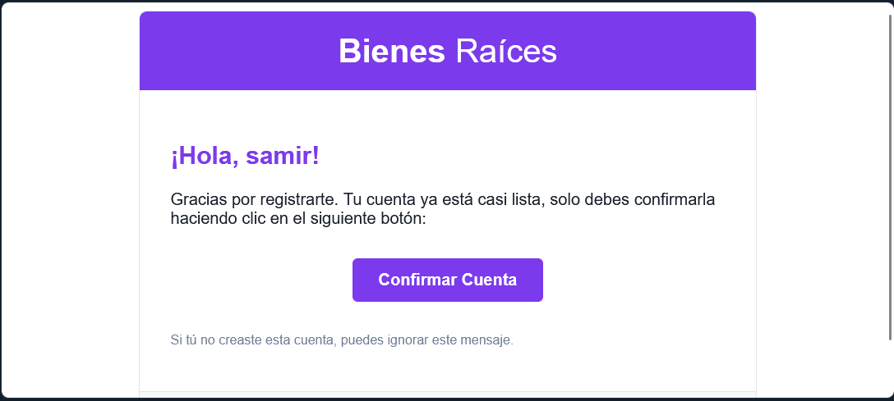
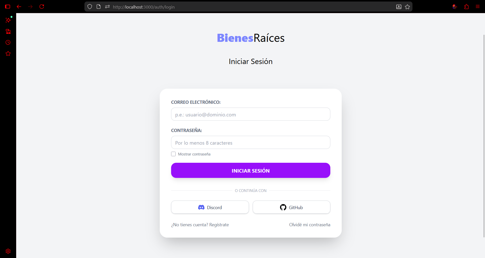
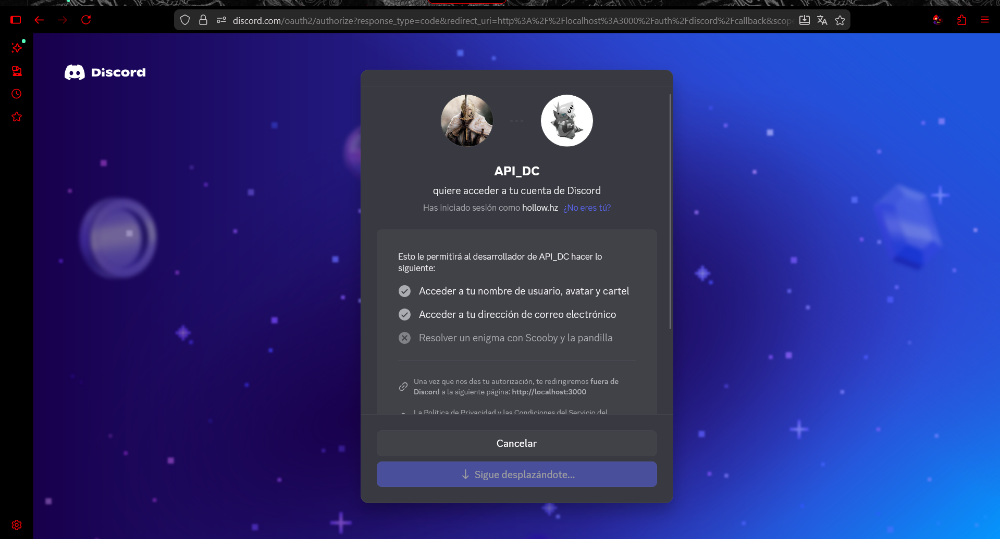
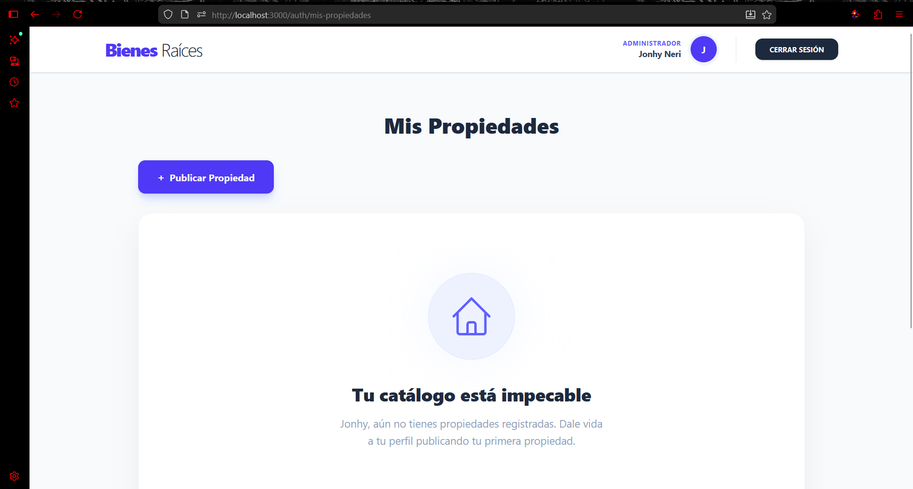
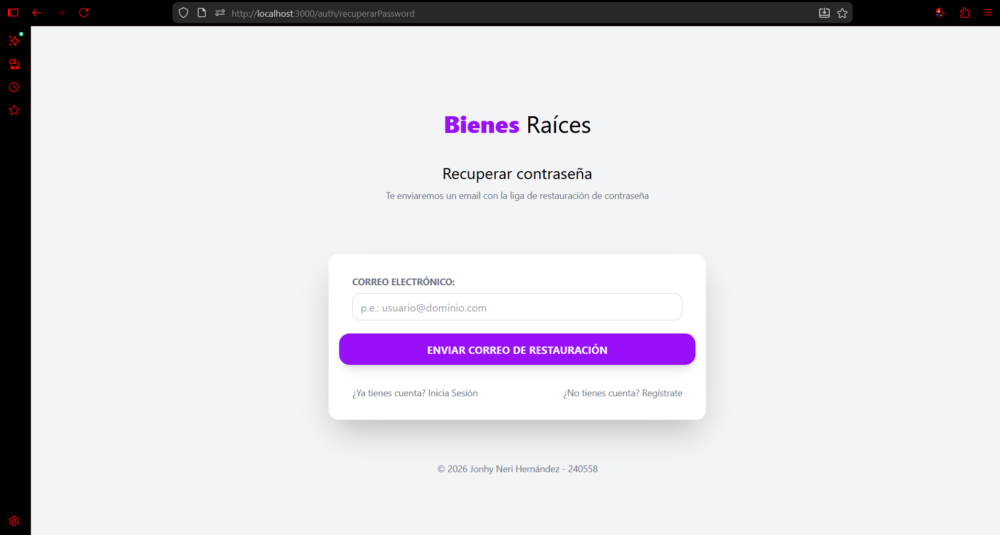
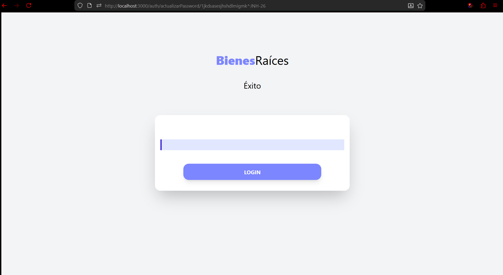
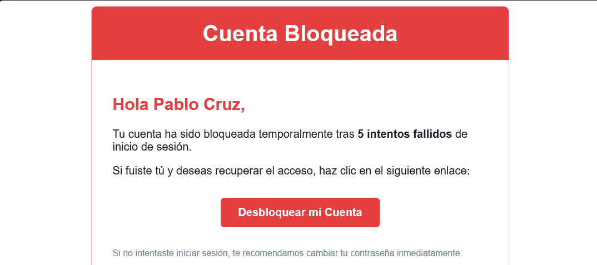
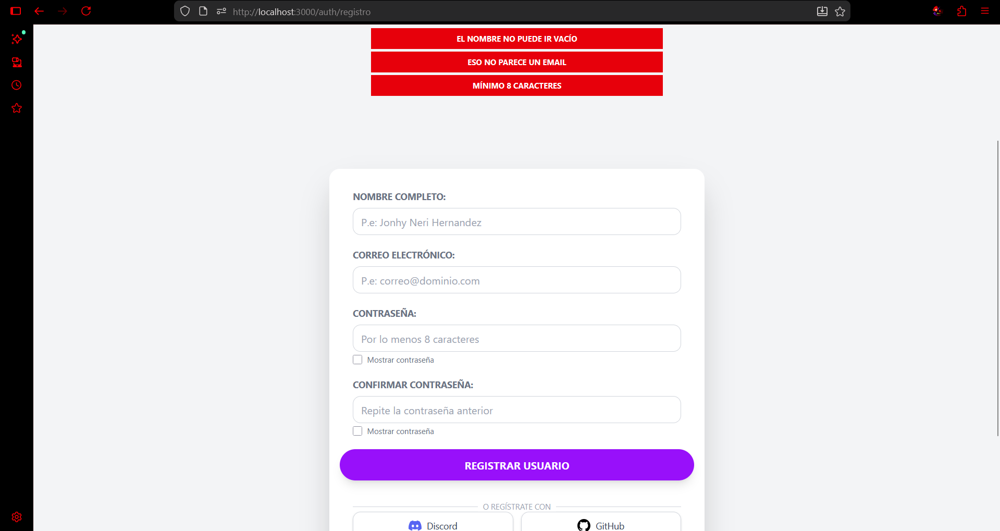
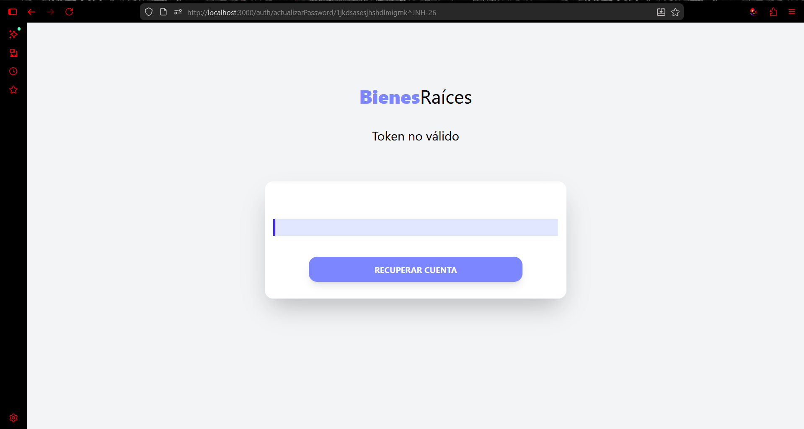
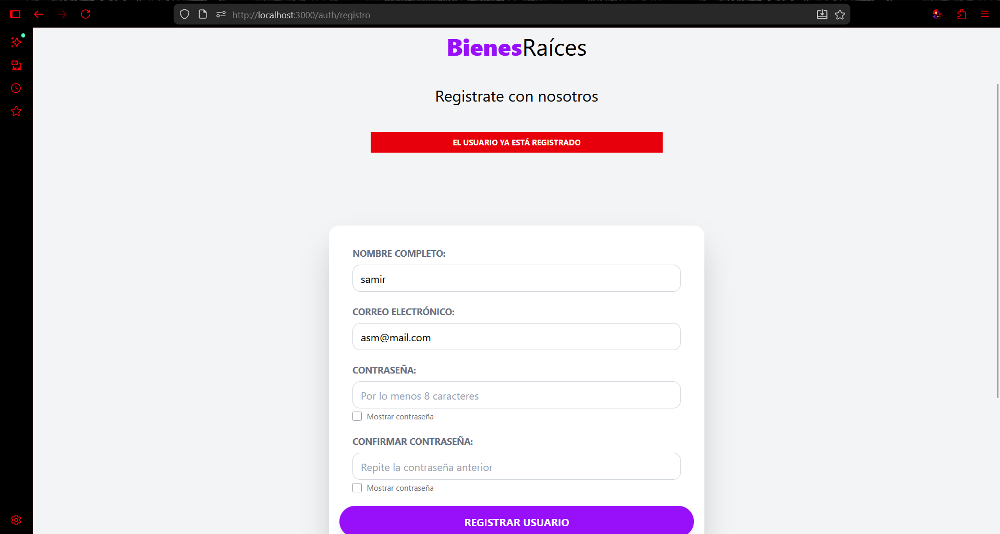

## Resultados Obtenidos (Evidencias del Sistema)

### 1. Autenticación y Registro de Usuarios
El sistema permite el registro de nuevos usuarios con validaciones de lado del servidor y la integración de OAuth2 para agilizar el acceso.

| Formulario de Registro | Registro Exitoso | Login Principal |
|---|---|---|
|  |  |  |

---

### 2. Integración con Redes Sociales (OAuth2)
Se implementó con éxito el inicio de sesión mediante **Discord** para facilitar la experiencia del usuario.

| Login con Discord | Panel de Propiedades |
|---|---|
|  |  |

---

### 3. Recuperación de Acceso y Seguridad
El sistema cuenta con un flujo completo de recuperación de contraseña mediante tokens por correo electrónico y medidas de seguridad contra ataques de fuerza bruta.

| Recuperar Contraseña | Cambio de Password | Cuenta Bloqueada |
|---|---|---|
|  |  |  |

---

### 4. Gestión de Errores y Validaciones
Se implementaron mensajes informativos para el usuario en caso de errores comunes, como tokens inválidos o registros duplicados.

| Error en Registro | Token Inválido / Expirado | Usuario Duplicado |
|---|---|---|
|  |  |  |

---